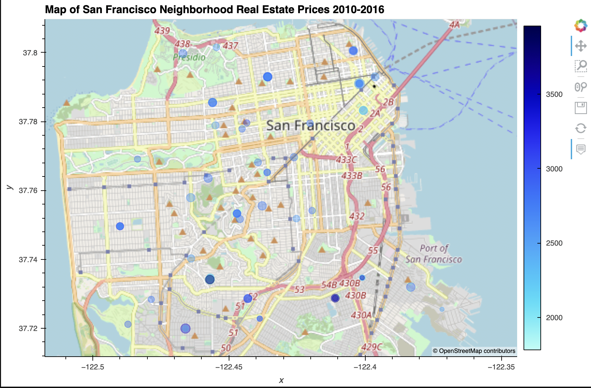

# Housing Rental Market Analysis for San Francisco

---

This Jupyter notebook application uses aggregation, interactive visualizations and geospatial analysis of census data for San Francisco neighborhoods for the years 2010-2016 to identify investment opportunities. Visualizations are created with the PyViz hvplot and GeoViews librairies. Total housing units per year, average sale prices per square foot, and gross rent are analyzed over time, and grouped by neighborhood, viewable as line plots by interactive widget. Finally, an interactive neighborhood map is created using point size and color to illustrate sale price per square foot and gross rent by neighborhood.

## *Technologies*
This application is written using Python 3.9.7 and uses historical census data for San Francisco neighborhoods. Interactive line plots and visualizations are created using the PyViz hvplot and GeoViews librairies.

## *Installation Guide*
Install the pandas, hvplot and numpy librairies, and Path from the pathlib library.

## *Usage*
Run the program from the command line as 'san_francisco_housing.py'.

## *Contributors*
This program was written by David Hockenbery with the assistance of the UW FinTech class of 2021 and instructors. Contact David at dhockenb@gmail.com.

## *License*
opyright (c) [2021] [David Hockenbery]

Permission is hereby granted, free of charge, to any person obtaining a copy
of this software and associated documentation files (the "Software"), to deal
in the Software without restriction, including without limitation the rights
to use, copy, modify, merge, publish, distribute, sublicense, and/or sell
copies of the Software, and to permit persons to whom the Software is
furnished to do so, subject to the following conditions:

The above copyright notice and this permission notice shall be included in all
copies or substantial portions of the Software.

THE SOFTWARE IS PROVIDED "AS IS", WITHOUT WARRANTY OF ANY KIND, EXPRESS OR
IMPLIED, INCLUDING BUT NOT LIMITED TO THE WARRANTIES OF MERCHANTABILITY,
FITNESS FOR A PARTICULAR PURPOSE AND NONINFRINGEMENT. IN NO EVENT SHALL THE
AUTHORS OR COPYRIGHT HOLDERS BE LIABLE FOR ANY CLAIM, DAMAGES OR OTHER
LIABILITY, WHETHER IN AN ACTION OF CONTRACT, TORT OR OTHERWISE, ARISING FROM,
OUT OF OR IN CONNECTION WITH THE SOFTWARE OR THE USE OR OTHER DEALINGS IN THE
SOFTWARE.